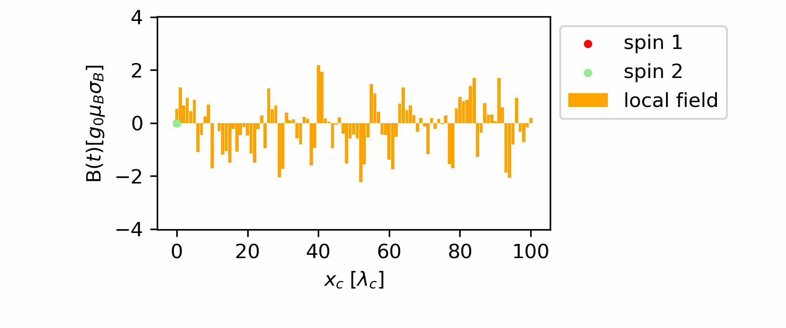

# SpinShuttling.jl
[](https://eigensolver.github.io/SpinShuttling.jl/dev/)


Simulate the open-system dynamics of a moving spin under correlated stochastic noise.

Install the package using the Julia package manager.
From the Julia REPL, type `]` to enter the Pkg REPL mode and run

```julia
pkg> add SpinShuttling
```

## Example: 

Consider two spin qubits sited on a closed pair of quantum dots (QDots). If the distance between the two QDots is small enough (microscopic or mesoscopic scale), then the noise experienced by them will have a non-zero covariance since they will be interacting with the same shared environment. The spatial correlation can be modeled by a Gaussian random field, $W(t, \boldsymbol{x})$. Since the wavefunction of the spin is highly constrained by the moving potential well. We can describe the position of a spin carrier (electron or holes), as a function of time $x(t, \boldsymbol{x})$. Such a trajectory will determine a route-specific projection on the field $W(t, \boldsymbol{x}(t))$, which gives the noise experienced by the spin. 

For multiple spin qubits sited within a microscopic nano device, their collective dephasing behavior will be non-trivially impacted by the covariance between noises. 



```julia
L=10; σ =sqrt(2)/20; M=5000; N=501; T1=100; T0=25; κₜ=1/20; κₓ=1/0.1;

B=OrnsteinUhlenbeckField(0,[κₜ,κₓ],σ)
model=TwoSpinSequentialModel(T0, T1, L, N, B)

Ψ= model.Ψ
ρ=Ψ*Ψ'
w=dephasingmatrix(model)

ρt=w.*ρ

println(ρ)
```

```
f1=statefidelity(model)
f2, f2_err=sampling(model, statefidelity, M)
f3=1/2*(1+W(T0, T1, L,B))

println("NI:", f1)
println("MC:", f2)
println("TH:", f3)
```

The quickstart page has a longer example. See the [documentation](https://eigensolver.github.io/SpinShuttling.jl/dev/) for details.

If you use SpinShuttling.jl in your research, please [cite](CITATION.bib) our work.
