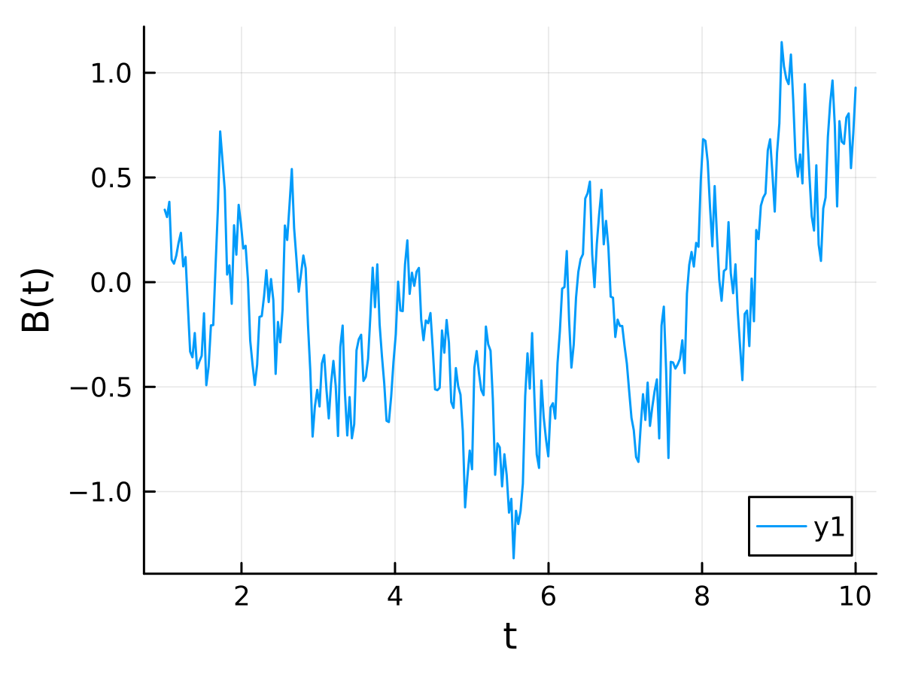
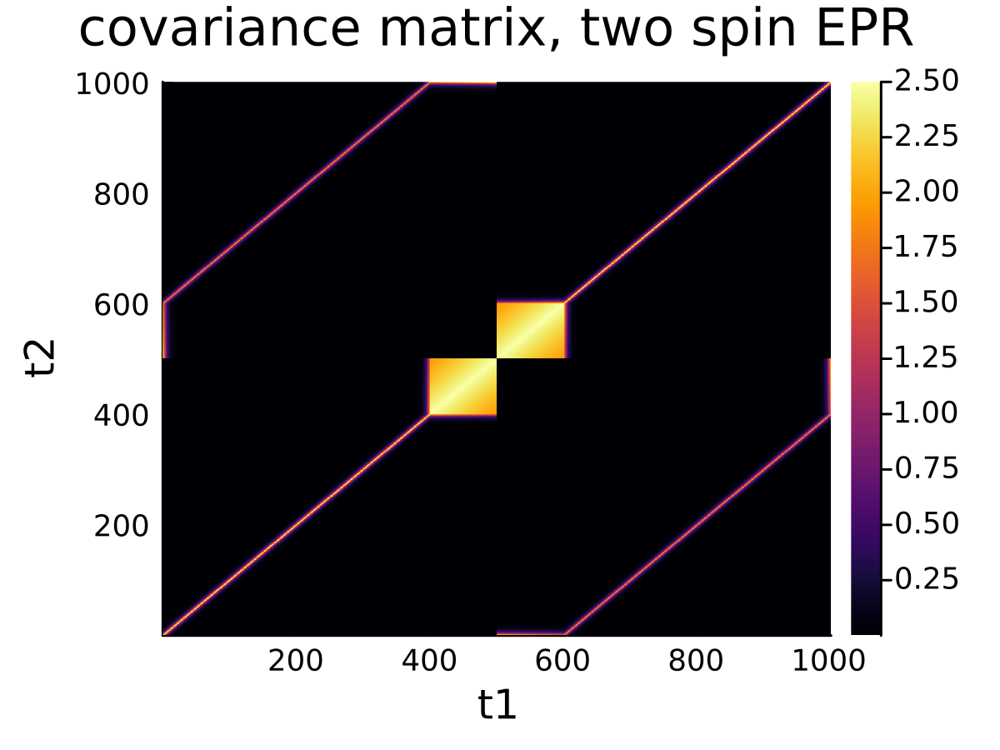

# Quick Start


## Basic model
$$
H_{noise}(t)=g \mu_B \sum_j \left[B_0(x^c_j)+\tilde{B}(x^c_{j},t)\right] S_j^z
$$
We assume the electrons are adiabatically transported in moving-wave potential with their wave-functions well localized at $x_j^c$. Then the effective magnetic noise $\tilde{B}(x_j^c, t)$ can be modeled by a Gaussian random field. 

In the case of pure dephasing, the system dynamics cna be explicitly writen out. 
$$
    U(t)=\exp(-\frac{i}{\hbar} \int_0^t H_{noise}(\tau)\mathrm{d} \tau)
$$

If we label a realization of the random process by $k$, then the pure dephasing channel can be expressed as a mixing unitary process.
$$
\mathcal{E}(\rho)=\frac{1}{M} \sum_{k=1}^M U_k \rho U_k^\dagger
=\sum_k E_k \rho E_k^\dagger, \quad E_k= U_k /\sqrt{M}
$$
The pure dephasing of such a system can be analytically solved and efficiently obtained via a matrix of dephasing factors. While more general system dynamics involving other interactions can be numerically solved by Monte-Carlo sampling.

$$
\mathcal{H}(t)=H_{noise}(t)+H_{int}(t)
$$

## Generating a noise series from a stochastic field
Import the package.
```julia
using SpinShuttling
using Plots
```
We first define an 2D Ornstein-Uhlenbeck field, specified by three parameters. 
```julia
κₜ=1/20; # inverse correlation time
κₓ=1/0.1; # inverse correlation length
σ = 1; # noise strength
B=OrnsteinUhlenbeckField(0,[κₜ,κₓ],σ); # mean is zero
```

Specify a trajectory `(t,x(t))` on the 2D plane, in this example case it's just a line. 
```julia
t=range(1,20,200); # time step
v=2; #velocity
P=collect(zip(t, v.*t));
```
A Gaussian random process (random function) can be obtained by projecting the Gaussian random field along the time-space array `P`. Then we can use `R()` to invoke the process and generating a random time series.
```julia
R=RandomFunction(P, B) 
plot(t, R(), xlabel="t", ylabel="B(t)", size=(400,300)) 
```




## Shuttling of a single spin
We can follow the above approach to define a single spin shuttling model.
```julia
σ = sqrt(2) / 20; # variance of the process
κₜ=1/20; # temporal correlation
κₓ=1/0.1; # spatial correlation
B=OrnsteinUhlenbeckField(0,[κₜ,κₓ],σ)
```

Consider the shuttling of a single spin at constant velocity `v`. 
We need to specify the initial state, travelling time `T` and length `L=v*T`, 
and the stochastic noise expreienced by the spin qubit.
```julia
T=400; # total time
L=10; # shuttling length
v=L/T;
```
The package provided a simple encapsulation for the single spin shuttling, namely
by `OneSpinModel`. 
We need to specify the discretization size and monte-carlo size to create a model.
```julia
M = 10000; # monte carlo sampling size
N=301; # discretization size
model=OneSpinModel(T,L,N,B)
```
The output will be
<pre>
Model for spin shuttling
Spin Number: n=1
Initial State: |Ψ₀⟩=[0.707, 0.707]
Noise Channel: OrnsteinUhlenbeckField(0, [0.05, 10.0], 0.07071067811865475)
Time Discretization: N=301
Process Time: T=400
Shuttling Paths:
      ┌──────────────────────────────┐      
   10 │⠀⠀⠀⠀⠀⠀⠀⠀⠀⠀⠀⠀⠀⠀⠀⠀⠀⠀⠀⠀⠀⠀⠀⠀⠀⠀⢀⡠⠖⠋│ x1(t)
      │⠀⠀⠀⠀⠀⠀⠀⠀⠀⠀⠀⠀⠀⠀⠀⠀⠀⠀⠀⠀⠀⠀⠀⣀⡴⠚⠉⠀⠀⠀│      
      │⠀⠀⠀⠀⠀⠀⠀⠀⠀⠀⠀⠀⠀⠀⠀⠀⠀⠀⠀⠀⣠⠴⠚⠁⠀⠀⠀⠀⠀⠀│      
      │⠀⠀⠀⠀⠀⠀⠀⠀⠀⠀⠀⠀⠀⠀⠀⠀⢀⡠⠖⠋⠀⠀⠀⠀⠀⠀⠀⠀⠀⠀│      
      │⠀⠀⠀⠀⠀⠀⠀⠀⠀⠀⠀⠀⠀⣀⡤⠞⠉⠀⠀⠀⠀⠀⠀⠀⠀⠀⠀⠀⠀⠀│      
      │⠀⠀⠀⠀⠀⠀⠀⠀⠀⠀⣠⠴⠋⠁⠀⠀⠀⠀⠀⠀⠀⠀⠀⠀⠀⠀⠀⠀⠀⠀│      
      │⠀⠀⠀⠀⠀⠀⢀⣠⠖⠋⠁⠀⠀⠀⠀⠀⠀⠀⠀⠀⠀⠀⠀⠀⠀⠀⠀⠀⠀⠀│      
      │⠀⠀⠀⣀⡤⠚⠉⠀⠀⠀⠀⠀⠀⠀⠀⠀⠀⠀⠀⠀⠀⠀⠀⠀⠀⠀⠀⠀⠀⠀│      
    0 │⣠⠴⠚⠁⠀⠀⠀⠀⠀⠀⠀⠀⠀⠀⠀⠀⠀⠀⠀⠀⠀⠀⠀⠀⠀⠀⠀⠀⠀⠀│      
      └──────────────────────────────┘      
      ⠀0⠀⠀⠀⠀⠀⠀⠀⠀⠀⠀⠀⠀⠀⠀⠀⠀⠀⠀⠀⠀⠀⠀⠀⠀⠀⠀400⠀      
</pre>
The fidelity of the spin state after shuttling can be calculated using numerical integration of the covariance matrix.  

This provides us an overview of the model. It's a single spin shuttling problem with initial state `Ψ₀` and an Ornstein-Uhlenbeck noise. The total time of simulation is `T`, which is discretized into `N` steps.  

The state fidelity after such a quantum process can be obtained by different numerical methods. 
```julia
f1=averagefidelity(model); # direct integration

f2, f2_err=sampling(model, fidelity, M); # Monte-Carlo sampling
```
For the single spin shuttling at constant velocity, analytical solution is also available. 
```julia
f3=1/2*(1+W(T,L,B));
```
We can compare the results form the three methods and check their consistency.
```julia
@assert isapprox(f1, f3,rtol=1e-2)
@assert isapprox(f2, f3, rtol=1e-2) 
println("NI:", f1)
println("MC:", f2)
println("TH:", f3)
```
```
NI:0.5172897445804854
MC:0.5210640948921192
TH:0.5183394145238882
```
The pure dephasing channel is computationaly simple, and can be represented by a dephasing matrix $w$, such that the final density state after the channel is given by $\mathcal{E}(\rho)=w \odot\rho$. Here $\odot$ is a element-wise Hadmard product. 
```julia
Ψ= model.Ψ
ρ=Ψ*Ψ'
w=dephasingmatrix(model)
w.*ρ
```
The final density matrix is shown in output. 
```
2×2 Matrix{Float64}:
 0.5        0.0172897
 0.0172897  0.5
```
We can check that the fidelity between the initial and final state is consistent with results above. 
```julia
f=(Ψ'*ρt*Ψ)
```

```
0.5172897445804852
```

## Dephasing of entangled spin pairs during shuttling. 
Following the approach above, we can further explore the multi-spin system. 
The general abstraction on such a problem is given by the data type `ShuttlingModel`.  
```julia
ShuttlingModel(n, Ψ, T, N, B, X, R)
```
User can freely define a n-qubit system with arbitrary initial state. Here, `X=[x1,x2...]` is an array of function, containing spin trajectories $x_i(t)$. `R` is a random function constructed from the specific noise process.  

One more example is the shuttling of two spin pairs. We can define such a two spin system. 
```julia
L=10; σ =sqrt(2)/20; M=5000; N=501; T1=100; T0=25; κₜ=1/20; κₓ=1/0.1;
B=OrnsteinUhlenbeckField(0,[κₜ,κₓ],σ)
model=TwoSpinModel(T0, T1, L, N, B)
```
<pre>
Model for spin shuttling
Spin Number: n=2
Initial State: |Ψ₀⟩=[0.0, 0.707, -0.707, 0.0]
Noise Channel: OrnsteinUhlenbeckField(0, [0.05, 10.0], 0.07071067811865475)
Time Discretization: N=501
Process Time: T=125
Shuttling Paths:
      ┌──────────────────────────────┐      
   10 │⠀⠀⠀⠀⠀⠀⠀⠀⠀⠀⠀⠀⠀⣠⠞⠉⠉⡹⠋⠀⠀⠀⠀⠀⠀⠀⠀⠀⠀⠀│ x1(t)
      │⠀⠀⠀⠀⠀⠀⠀⠀⠀⠀⠀⢀⡜⠁⠀⣠⠞⠁⠀⠀⠀⠀⠀⠀⠀⠀⠀⠀⠀⠀│ x2(t)
      │⠀⠀⠀⠀⠀⠀⠀⠀⠀⠀⡴⠋⠀⢀⡴⠁⠀⠀⠀⠀⠀⠀⠀⠀⠀⠀⠀⠀⠀⠀│      
      │⠀⠀⠀⠀⠀⠀⠀⠀⣠⠞⠀⠀⡰⠋⠀⠀⠀⠀⠀⠀⠀⠀⠀⠀⠀⠀⠀⠀⠀⠀│      
      │⠀⠀⠀⠀⠀⠀⢀⡼⠁⠀⣠⠞⠁⠀⠀⠀⠀⠀⠀⠀⠀⠀⠀⠀⠀⠀⠀⠀⠀⠀│      
      │⠀⠀⠀⠀⠀⡴⠋⠀⢀⡴⠁⠀⠀⠀⠀⠀⠀⠀⠀⠀⠀⠀⠀⠀⠀⠀⠀⠀⠀⠀│      
      │⠀⠀⠀⣠⠞⠀⠀⡰⠋⠀⠀⠀⠀⠀⠀⠀⠀⠀⠀⠀⠀⠀⠀⠀⠀⠀⠀⠀⠀⠀│      
      │⠀⢀⡜⠁⠀⣠⠞⠁⠀⠀⠀⠀⠀⠀⠀⠀⠀⠀⠀⠀⠀⠀⠀⠀⠀⠀⠀⠀⠀⠀│      
    0 │⣴⣋⣀⣀⡴⠁⠀⠀⠀⠀⠀⠀⠀⠀⠀⠀⠀⠀⠀⠀⠀⠀⠀⠀⠀⠀⠀⠀⠀⠀│      
      └──────────────────────────────┘      
      ⠀0⠀⠀⠀⠀⠀⠀⠀⠀⠀⠀⠀⠀⠀⠀⠀⠀⠀⠀⠀⠀⠀⠀⠀⠀⠀⠀200⠀      
</pre>
The system is initialized in the Bell state $\ket{\Psi^-}$. 
The model encapsulated a model of two spin shuttled in a sequential manner, as we can see from the two trajectories `x1(t)` and `x2(t)`. One spin goes first and then follows another, with waiting time `T0`. This is modeled by the piece-wise linear trajectories. 
We can see some quite interesting covariance from such a system.
```julia
heatmap(collect(model.R.Σ), title="cross covariance matrix, two spin EPR")
```


We can check that the dephasing of the system and calculate its fidelity as before. 
```julia 
f1=averagefidelity(model)
f2, f2_err=sampling(model, fidelity, M)
f3=1/2*(1+W(T0, T1, L,B))

println("NI:", f1)
println("MC:", f2)
println("TH:", f3)
```

```
NI:0.970066663028708
MC:0.9699908129499957
TH:0.9700818676163352
```
The density matrix after the channel can be given by the dephasing matrix.
```julia
Ψ= model.Ψ
ρ=Ψ*Ψ'
w=dephasingmatrix(model)

ρt=w.*ρ
```

```
4×4 Matrix{Float64}:
  0.0   0.0       -0.0        0.0
  0.0   0.5       -0.470067   0.0
 -0.0  -0.470067   0.5       -0.0
  0.0   0.0       -0.0        0.0
```